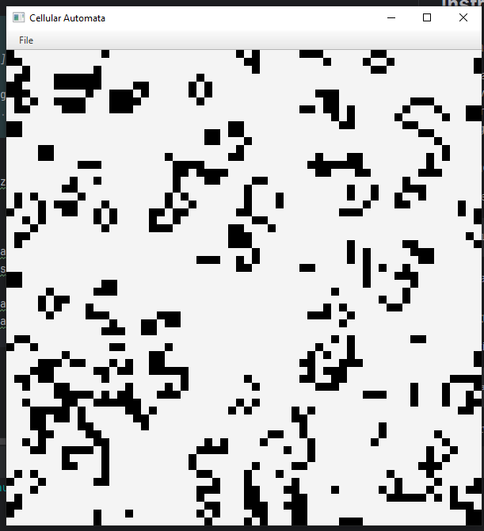
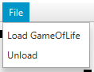

## Instrukcja obsługi

### Wymagania
- Java 21+
- Maven
- (Windows) — w `pom.xml` mamy zadeklarowane `-Djavafx.allowjs=true` w konfiguracji pluginu JavaFX

### Uruchomienie aplikacji
Dzięki deklaracji JVM-arg w `pom.xml` możesz od razu wywołać:
```
mvn clean javafx:run
```
Aplikacja uruchomi się z włączonym skryptowaniem JavaScript dla JavaFX.



### Struktura skryptów
Wszystkie pliki JavaScript (`.js`) z implementacjami automatów komórkowych znajdują się w:
```
src/main/resources/scripts/
```
- Nazwa pliku (np. `GameOfLife.js`) musi odpowiadać nazwie funkcji definiującej automat.

### Dodawanie nowego automatu
1. Stwórz plik `NewAutomaton.js` w folderze `src/main/resources/scripts/`.
2. Zaimplementuj funkcję:
   ```javascript
   /**
    * @param {boolean[][]} grid — bieżący stan
    * @returns {boolean[][]} — nowy stan
    */
   function NewAutomaton(grid) {
     // ...logika automatu...
     return newGrid;
   }
   ```
3. W menu aplikacji wybierz opcję **File → Load NewAutomaton**, aby przeładować i uruchomić nowy automat.

### Sterowanie aplikacją
- **Start**  
  Automatyczna animacja startuje po uruchomieniu.
- **Ładowanie/Wyładowanie skryptu**  
  W menu **File**:
    - **Load <Nazwa>** — załadowanie automatu o zadanej nazwie
    - **Unload** — wyładowanie bieżącego skryptu


